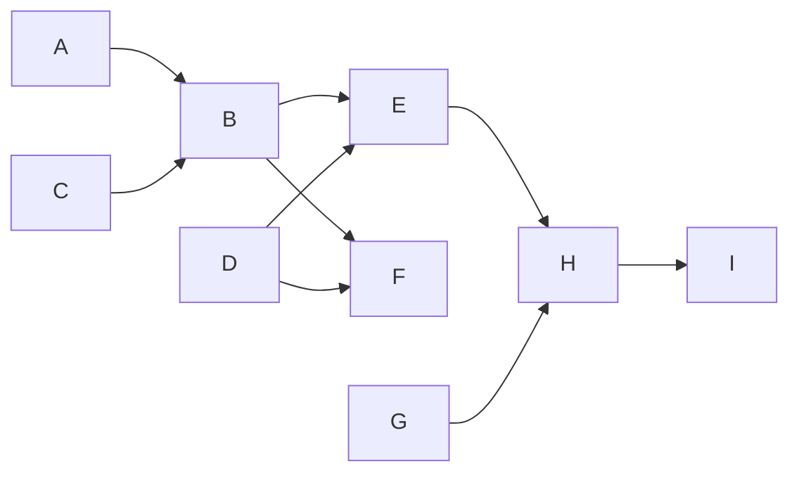

## Take-Home Assignment: Full Stack

### Objective

You are tasked with building a visualization tool for a build system, which can be represented as a Directed Acyclic Graph (DAG). Below is an example DAG. Note that the parent-child relationships are many-to-many, and cycles are not possible.



Each node in the DAG contains the following information:

- `node_name`: A unique identifier for the node (e.g., `A`, `B`, `C`), which will be displayed in the graph.
- `node_type`: One of four fixed types: `TYPE_1`, `TYPE_2`, `TYPE_3`, `TYPE_4`
- `tags`: An array of strings representing tags on this node.

---

### Problem

You need to create an application that supports the following features:

1. **Auto-complete search**: Allow users to search for nodes by `node_name` using an auto-complete feature.
2. **Display upstream dependencies**: Once a node is selected from the auto-complete dropdown, display its upstream dependencies as a subgraph.
   - For example, selecting node `E` should render the following subgraph:
   ```mermaid
   graph LR
       A --> B
       C --> B
       B --> E
       D --> E
   ```
3. **Node details**: When a node is clicked within the graph, display its information (e.g., `node_type`, `tags`) in a sidebar on the right-hand side of the screen.
4. **BONUS**: Include an option to limit the depth of the displayed graph by specifying the number of levels to show.

---

### What We Are Looking For

1. **Quick learning and application of unfamiliar technologies**:
   - Use **Svelte 5** to build the application, including the newly introduced concepts such as runes, `$state`, and `$effect` to handle reactivity.
   - You may use **Tailwind CSS** or any component library you’re familiar with for styling.

2. **Simplicity and capability**:
   - Build a straightforward yet well-engineered application that demonstrates solid architectural choices, clean and maintainable code, and efficient data handling.

3. **User Experience (UX) and Design**:
   - Design is a key aspect. We expect a clean, intuitive, and responsive user interface that enhances usability. Thoughtful consideration should be given to user interactions, layout, and overall experience.
  
4. **Simple Backend**:
   - You may choose to use Express.js or simply a local TypeScript file to mock the backend responses. The backend's main purpose is to serve the DAG structure and node details, simulating an API response.
   - **NOTE:** Deploying with certain backend technologies can be tricky. Keeping the backend simple will help avoid unnecessary complications.

6. **Deployment**:
   - Deploy the application to a platform like **Vercel** or any similar service. We want to see the app running in a production-like environment.

---

### Submission

Submit your solution in a GitHub repository, including instructions on how to run it locally and a link to the live deployment.
